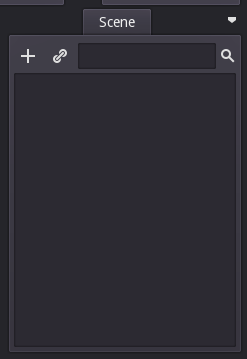
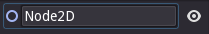
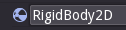
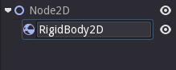
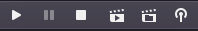
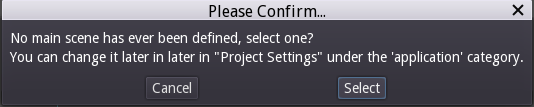
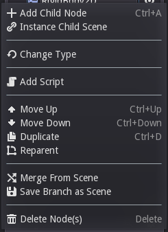

#Les 1

Je bent nu binnen in Godot. 

Als je dat nog niet gedaan hebt ga dan naar https://github.com/jorn600/Godot-lessen/blob/master/README.md.

In les 1 gaan we een vallend blokje maken.

Dat doen we in 2d mode. Om 2d mode in te schakelen meot je linksboven op 2d klikken.

Nu moeten we een wereld hiervoor maken.
Hiervoor klik je op het plusje. 

Nu moet je zoeken naar "Node 2d"

Klik erop en klik daarna op "Create".
Nu staat je Node 2d in je scene.
Je kunt hem anders noemen door er op te klikken en dan te gaan typen.
Noem de Node 2d "Wereld"

Selecteer nu Wereld en klik weer op het plusje.
Zoek nu "RigidBody2d".
Een RigidBody2d is een Object die automatisch zwaartekracht heeft.

Noem de RigidBody "Blok"

Klik nu op Blok en daarna op plusje en zoek naar sprite.
Een sprite is een plaatje voor je Blok.

Klik nu op Create.

Klik weer op het plusje en zoek daarna naar collisionshape2d.
Dat is hetgene waarmee het andere Object mee botst.

Nu zie je rechtsonder een menu als je op collisoinshape klikt.
Hierin zie je dit.

klik nu op "Null".
en daarna op "new rectangle shape". 

Nu klik je op sprite.
En dan op texture.

Nu load je het robot plaatje.
Scroll hier naar onderen totdat je "scale" ziet staan.

Verander de scale van 1,1 naar 0.3,0,3.
Selecteer nu Blok en klik boven op dit knopje

Nu kun je boven op het driehokje klikken.
Er staat nu dat je een "main scene" moet selecteren.
Klik hier op oke.

Als je er nu weer op klikt komt er weer een scherm te voorschijn.
Klik hier op "save" of "oke".

Klik er nu nog een keer open en er opent een window.
Dit is je game!

(:
