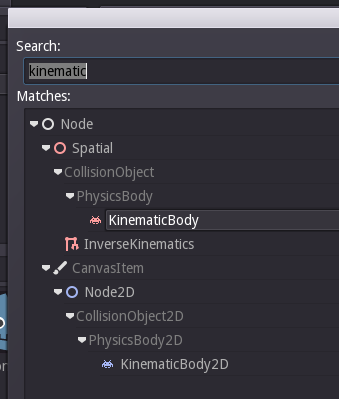
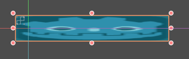

#Godot les 2
###Een stuiterend blokje

Zoals je gezien hebt in les 1, heb je een collisionshape2d gemaakt.
Dit botst met een andere collisionshape, maar hoe maken we die.
Dit gaan we doen in les 2.

Hiervoor moeten we een ander blok maken.
Een kinematicbody2d.

Die maak je aan door wereld te selecteren en op plusje te klikken.
Zoek nu kinematicbody2d op.
Selecteer die en klik nu op create.

Deze moet ook een sprite hebben.
Geef deze dezelfde sprite als je ground.
Geef deze ook een collisionshape2d.

Nu kun je de ground wat breder maken.

Het zou er ongeveer zo uit moeten zien

Nu start je het programma.

Om alles nu te laten stuiteren geef je de KinematicBody en Rigidbody een collisionshape2d.

Ga nu naar rechtsonder en selecteer "null" en klik op "New Rectangle".

En klik nu op het pijltje daarnaast.

Vul nu bij Extents 32,32 in.

Doe dit bij de kinematicbody2d en de rigidbody2d.

Nu kun je je scene runnen.

HuH?!

Hij stuitert helemaal niet, dit doe je door naar je rigidbody te gaan en bounce op 1 zetten.

Nu stuitert je blokje, jippie!
