#Les 1
###Een vallend blokje

```Goed! Je bent nu binnen in Godot.```
```Wat we nu gaan doen is een vallend blokje maken.```
```Om dat te doen moeten we de game mode - dat is wat voor soort game het is - in 2d mode zetten.```
```Hiervoor klik je op de "2d" knop, linksbovenin.```

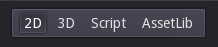

```De 2d knop zet de wereld in een 2d modes.```
```Dit betekent dat je game er meer uit gaat zien als iets van Mario, dan Skylanders.```

```Nu moeten we een wereld maken.```
```Dit doen we door rechts, in het scene-menu, op het plusje te klikken.```

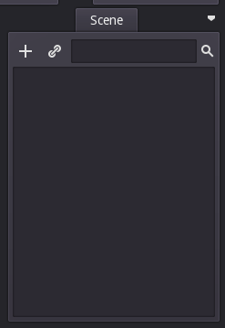

```Als je op het plusje klikt, komen er allemaal dingen te voorschijn.```

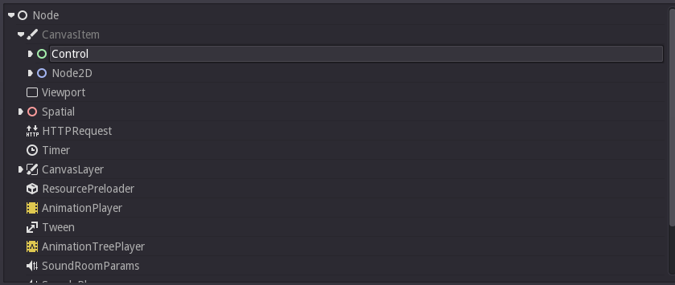

```Dit zijn "nodes".```
```Een node is een soort object.```
```Bijvoorbeeld is een sprite2d, een plaatje.```
```Dus als je een plaatje wil, dan klik je op het plusje.```
```Zoek je "sprite" op.``` 
```En klik je daar op.```

```Alleen voor je dit doet, moet je een wereld maken.```
```Waar al je nodes in kunnen staan```
```Klik weer op het plusje.```
```En zoek naar "Node2d"```
```Selecteer Node2d en klik op create``` 

```Nu zou je scene-menu er zo uit moeten zien```

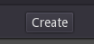

```We willen nu een speler maken.```
```Hiervoor moeten we een "RigidBody2d" maken.```
```Een RigidBody2d is een poppetje dat automatish een zwaartekracht heeft.```
```Ook kun je aan een RigidBody2d allemaal andere waardes geven.```
```Laten we nu een RigidBody maken!```

```Create nu een Rigidbody2d onder je Node2d.```

```Als we dit zeggen bedoelen we dat je Node2d in het scene-menu moet slecteren door er op te klikken.```
```Je weet dat iets geselecteerd is.``` 

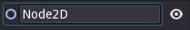

```En dan klik je op het plusje en zoek je naar Rigidbody2d.```

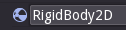

```Als het goed is zou het er zo uit moeten zien.```

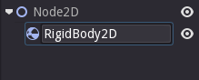

```Je kunt nu het programma starten door in het midden boven op een driehoekje te klikken.```

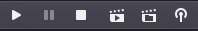

```He? er staat opeens "This scene hasnever been saved. Save before running?"```

```Dit betekent of je het project wilt opslaan voordat je het uitvoert, klik op yes.```
```Klik nu op save.```

```Er staat nu nog iets!```

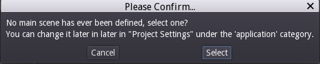

```Dit zegt dat je nog geen scene hebt geselecteerd.```
```Klik op "select".```
```En dan op "open".```

```Klik nu nog een keer op het driehoekje.```
```Nu start je je game op.```

```He? Er komt een scherm tevoorschijn zonder iets erin.```
```Dit komt omdat je nooit een plaatje hebt gegeven aan je speler`

```Doe dit door je rigidbody2d een "sprite" te geven.```
```Hiervoor selecteer je RigidBody2d.```
```Klik je op de rechtermuisknop.```
```En daarna bovenaan op "add child node".```

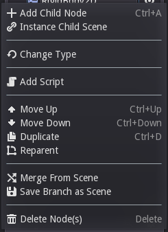

```Nu komen alle Nodes weer tevoorschijn.```
```Zoek nu naar "Sprite".```

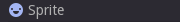

```En klik op create.```

```Nu zie je rechtsonder, dit staan.```

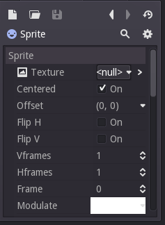

```Klik daar op "null", en daarna op "load".```

```Klik nu op dit plaatje.```

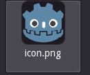

```En klik daarna op "open".```

```Nu heeft je speler een plaatje!```
```Je kunt nu weer op het driehoekje klikken.```
```Dan start je game(:```

```Je kunt je speler nu in het midden van het scherm krijgen door RigidBody2d te selecteren.```
```En daarna op dit knopje te klikken:```

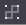

```Goed!```
```Je bent nu klaar met de eerste les.```

