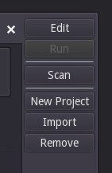
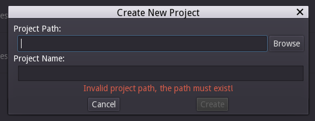
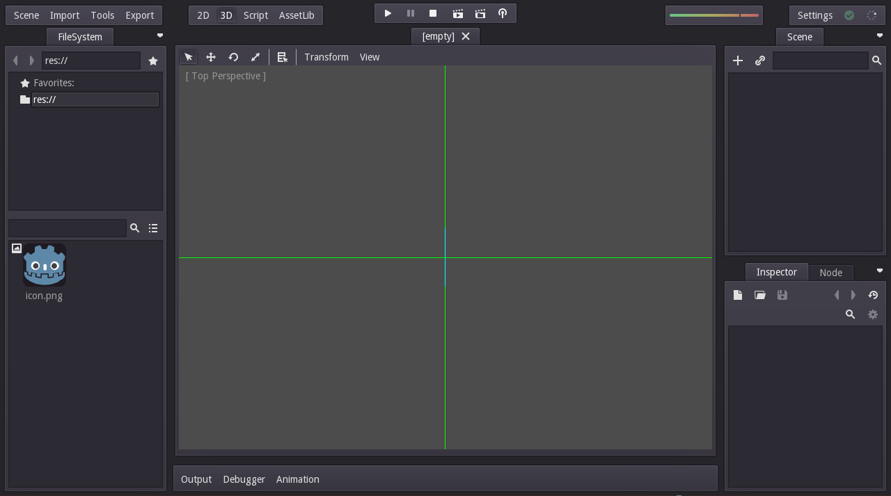

# Godot-lessen
Draaiboek Godot lessen de jonge onderzoekers.

Hee! In dit boek ga je leren over Godot, een game engine. Dat is een programma waarin je computerspelltejes mee kunt maken.

Je kunt Godot downloaden op godotengine.org Je klikt eerst op de download | 2.1 knop en dan kies je de versie uit voor jou computer.

Wat we in Godot gaan doen is een speletje maken waarin je kunt lopen, springen, rennen en mischien ook schieten.

Als je Godot opent ziet het er ongeveer zo uit.

Nu je hier bent wil je een nieuw project maken, dat doe je door rechtsboven op "New Project" te klikken.

Als je daarop klikt komt er een window te voorschijn, hierin sla je je project op.

Zorg voor een goede plek voor je project waar je hem altijd terug zal vinden! Zoals je bureaublad.
Nu geef je je project een naam en klik je op Create.

Als het good is komt dan dit scherm te voorschijn.

Nu ben je binnen in Godot!
Hoera!
