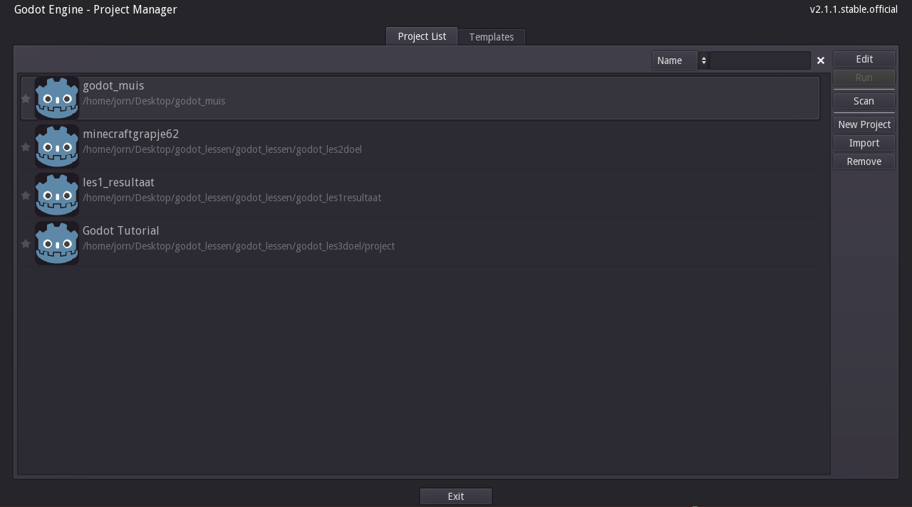

# Godot-lessen
Draaiboek Godot lessen de jonge onderzoekers.

Hee! In dit boek ga je leren over Godot, een game engine. Dat is een programma waarin je computerspelltejes mee kunt maken.

Je kunt Godot downloaden op godotengine.org Je klikt eerst op de download | 2.1 knop en dan kies je de versie uit voor jou computer.

Wat we in Godot gaan doen is een speletje maken waarin je kunt lopen, springen, rennen en mischien ook schieten.

Als je Godot opent ziet het er zo uit.

